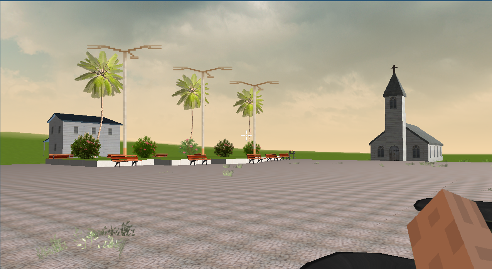
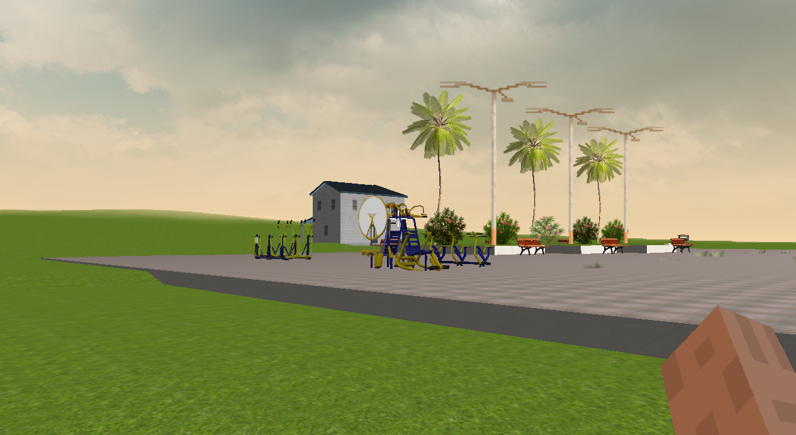
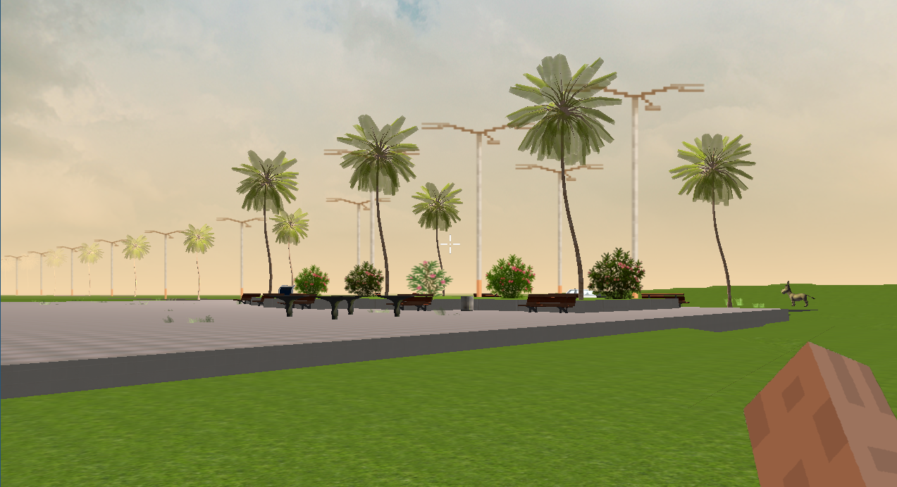
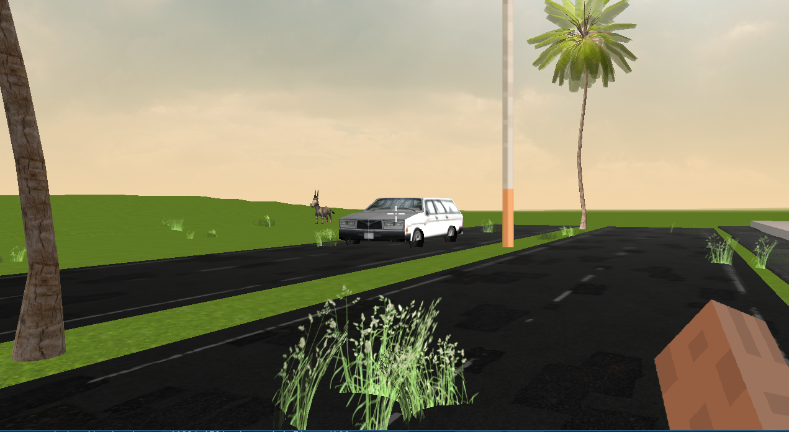
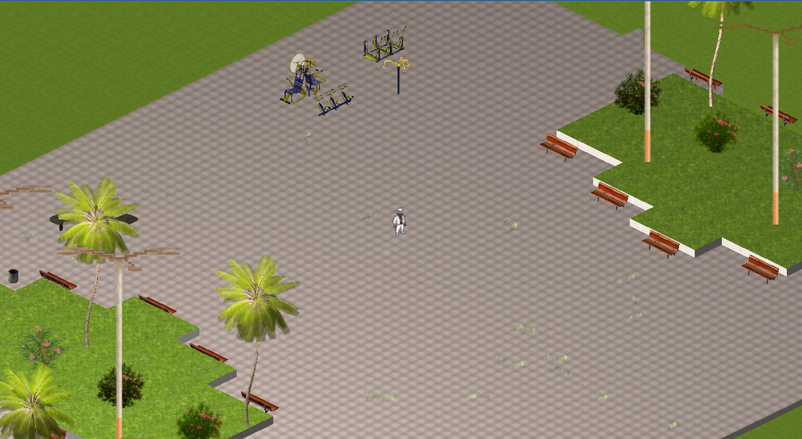

# Trabalho CG 2025.1 
Trabalho da disciplina de Computação Gráfica 2025.1 da UFC Campus Russas. O trabalho trata-se de um cenário parecido com a vida real, no caso desse uma praça localizada na cidade de Palhano Ceará.

Precisa baixar e colocar a pasta assets/ na raíz do diretório. 
[assets](https://drive.google.com/file/d/1mJ1MXXCVFE2NfjW2F81eJxiDSuQTc8xS/view?usp=sharing)

## Como executar: 
```bash
cmake -B build
chmod +x ./run.sh
./run.sh
```

## Fotos





